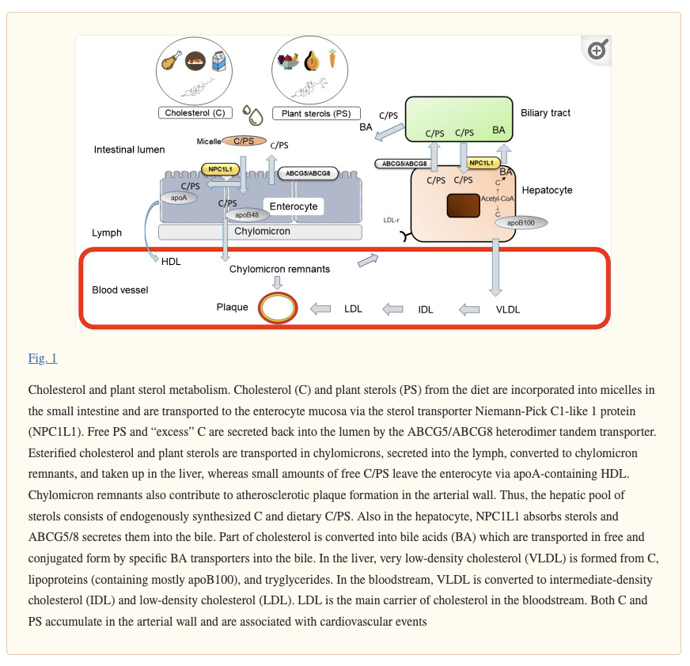

# Phytosterols

## Literature

### Phytosterols and Cardiovascular Disease
#### [Phytosterols and Cardiovascular Disease (2021)](https://www.ncbi.nlm.nih.gov/pmc/articles/PMC8410723/)

> Cholesterol and phytosterols are absorbed in the small intestine (Fig. 1). They are solubilized and incorporated into micelles and absorbed via a specific carrier — Niemann-Pick C1-like protein 1 (NPC1L1) [12]. The heterodimer ATP binding cassette transporter G5 and G8 (ABCG5/8) secretes phytosterols and small amounts of cholesterol back into the intestinal lumen [13, 14]. The same processes occur in the hepatocyte, where both NPC1L1 and ABCG5/8 are expressed. As a result of this selection, which can be interpreted as a “defense mechanism” against phytosterols, plasma plant sterol concentration is 1000-fold lower than plasma cholesterol levels.

Animal studies are inconsistent, with some studies showing no effect.
The studies showing negative effects involved:
1. [Very high levels](https://www.sciencedirect.com/science/article/pii/S0735109708004579?via%3Dihub): 2% phytosterols by weight.
   This would be equivalent to a human eating tens of grams of phytosterols per day.
   In this study, atherosclerotic plaques were still reduced relative to the control, but were larger than treatment with ezetimibe (a drug that acts in a similar way, preventing reabsorption of phytosterols).
   The plaques also contained phytosterols, supporting the idea that phytosterol in blood can cause atherosclerotic plaques, supported by the pathology of [sitosterolemia](https://en.wikipedia.org/wiki/Sitosterolemia).
   Still, it seems like this study shows that phytosterol supplementation is probably effective, just less effective than ezetimibe (in mice). 
   This study also looked at humans taking a phytosterol-supplemented margarine.
   There was a correlation of campesterol in serum and the concentration in aortic valve cusps. 
   **Note**: Figure 6(B) is a little confusing since capesterol and lathosterol are measured in µg / mg cholesterol, while cholesterol is measured relative to the medium (mg/dl plasma; ng/mg aortic valve).
2. Models of sitosterolemia, (ABCG5/ABCG8 knockouts). Probably not relevant.

Also of note:
> As early as 2000, Ratnayake and colleagues found that vegetable oil rich in phytosterols makes red blood cells more rigid and less flexible and results in significant shortening of the lifespan of rats [[59]](https://pubmed.ncbi.nlm.nih.gov/10801914/). This finding leads to the ban of any phytosterol-enriched foods in Canada in 2003 [[60]](https://www.ncbi.nlm.nih.gov/pmc/articles/PMC2642922/).

#### [Phytosterols in the Treatment of Hypercholesterolemia and Prevention of Cardiovascular Diseases (2017)](https://www.ncbi.nlm.nih.gov/pmc/articles/PMC5729784/)

TODO

#### [Phytosterol Intake and Risk of Coronary Heart Disease in U.S. Men and Women (2022)](https://www.ahajournals.org/doi/10.1161/circ.146.suppl_1.13262)

Showed hazard ratios <1 for dietary consumption of total phytosterols, and for campesterol, stigmasterol and beta-sitosterol, using food frequency questionaires.
Given that fatty plant foods may be healthy for many reasons and that fatty animal foods are probably unhealthy, this seems very confounded.
Also, food frequency questionaires are kinda sketch.

Of note:
> Phytosterol intake was not associated with LDL or HDL cholesterol levels.

However, the maximum dietary consumption is probably too low to have much effect on LDL levels.

## Key questions
### Are phytosterols safe/effective?

Current thinking (Feb 2024):
* They probably contribute slightly to atherosclerosis.
* The atherosclerotic effect is significantly mediated by transporters that remove them from the blood and the preference for cholesterol of transporters that move cholesterol from the intestine to the blood.
  In particular, the plasma concentration remains low with moderate supplementation.
* The reduction of cholesterol from moderate supplementation is probably on-balance good, but less good than a drug like ezetimibe.
  Statins also seem like a better option.
* Eating foods rich in phytosterols like nuts, vegetable oils and some vegetables is probably good.
* Supplementing > 2g per day is probably unwise.
  The 2g/day dose does lower LDL levels, and is much lower than the levels usually used in animal models showing negative effects.
* It would be good to have more studies on all-cause mortality and cardiac events, but it works in a similar fashion to drugs and reducing LDL cholesterol levels tends to reduce atherosclerosis.
